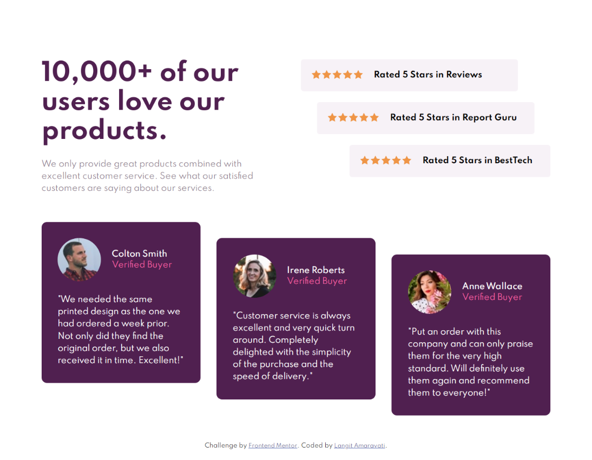

# Frontend Mentor - Social proof section solution

This is a solution to the [Social proof section challenge on Frontend Mentor](https://www.frontendmentor.io/challenges/social-proof-section-6e0qTv_bA). Frontend Mentor challenges help you improve your coding skills by building realistic projects.

## Table of contents

- [Overview](#overview)
  - [The challenge](#the-challenge)
  - [Screenshot](#screenshot)
  - [Links](#links)
- [My process](#my-process)
  - [Built with](#built-with)
  - [What I learned](#what-i-learned)
  - [Continued development](#continued-development)
- [Author](#author)

## Overview - Latihan Grid

### The challenge

Users should be able to:

- View the optimal layout for the section depending on their device's screen size

### Screenshot



### Links

- Solution URL: [repo](https://github.com/eLAmaravati/social-proof-section.io)
- Live Site URL: [demo](https://elamaravati.github.io/social-proof-section.io/)

## My process

### Built with

- Semantic HTML5 markup
- CSS custom properties
- Flexbox
- CSS Grid
- Mobile-first workflow
- BEM

### What I learned

- Mendaras kembali CSS layouting dengan grid.
- Belajar BEM metodologi meski masih kurang paham.
- Menemukan cara untuk menambahkan dua image sebagai background.
- Belajar kembali nth-child.

```html
<div class="rating-item__content">Rated 5 Stars in Reviews</div>
```

```css
main {
  display: grid;
  grid-template-areas:
    "header header header header empty rating rating rating rating"
    "testimonyone testimonyone testimonyone testimonytwoo testimonytwoo testimonytwoo testimonythree testimonythree testimonythree";
  grid-template-columns: repeat(9, 1fr);
  grid-template-rows: auto;
  padding: 10% 7%;
  column-gap: 30px;
  row-gap: 50px;
}

.rating-item:nth-child(1) {
  margin-right: 60px;
  margin-left: -60px;
}
```

### Continued development

Grid sangat membantu untuk membuat layout halaman web yang cukup kompleks. Tetapi, cukup rumit untuk diimplementasikan, terutama jika banyak elemen-elemen kecil di dalamnya. Pun, menghambat waktu development. Saya lebih suka menggunakan Bootsrap karena bukan hanya lebih mudah, tapi juga lebih cepat.

## Author

- Website - [Langit Amaravati](https://www.langitamaravati.com)
- Frontend Mentor - [@eLAmaravati](https://www.frontendmentor.io/profile/eLAmaravati)
- Twitter - [@eLAmaravati](https://www.twitter.com/eLAmaravati)
